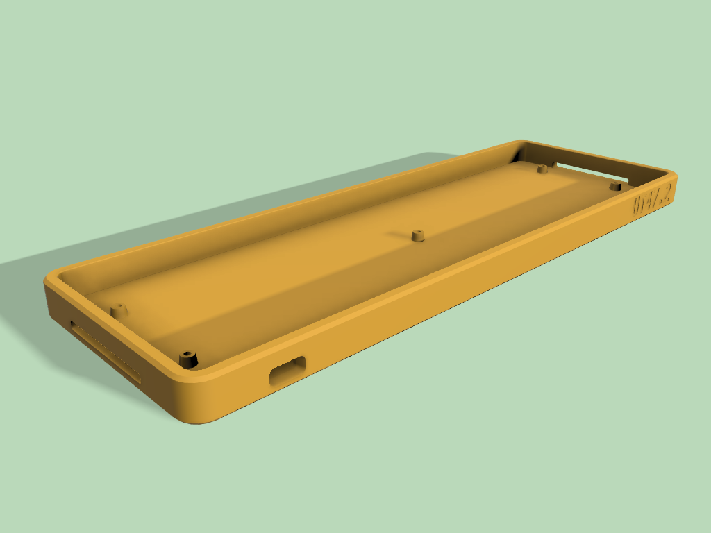
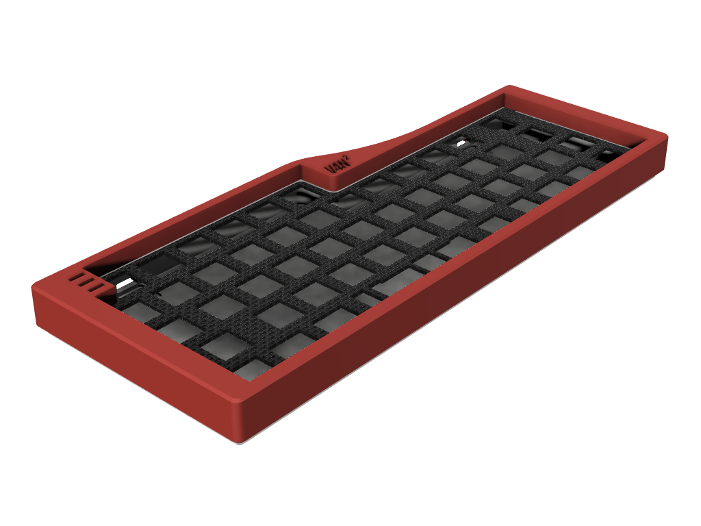

# Cases:

| UT47.2 TM Case | Vandal for V4N4G0N-compatible | V4N^2 for V4N4G0N-compatible |
| --- | --- | --- |
|  |  |  |

# Vial firmwares:

[Library](https://github.com/ba-keyboards/vial-firmwares)
